电控组第 2 讲的课程笔记整理。这一讲分上、下两篇：上篇讲原理（GPIO、TIM、PWM），下篇讲实践（从原理图读电路、CubeMX 生成工程、Keil 里点灯调试、用定时器做非阻塞延时、最后用状态机 + J-Scope 验证）。整讲的主线是一句大白话：**嵌入式代码的构建高度依赖其物理载体——单片机**，所以先从单片机本身说起。

## 一、先认识单片机：STM32G431RBT6

单片机是嵌入式代码的物理载体，理解代码之前先理解这颗芯片。从外部看，它是一块芯片实物，对应着原理图符号、PCB 封装；从内部看，它由各种功能模块（CPU、存储器、GPIO、定时器、通信外设等）组成，可以通过引脚（PIN）与外界进行电气连接。

<figure>
    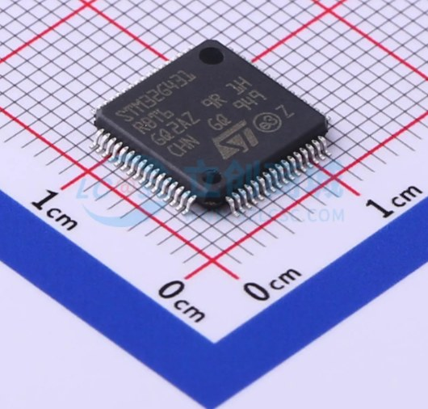
    <figcaption>STM32 芯片实物（同一型号，板级电路可能不同）</figcaption>
</figure>

<figure>
    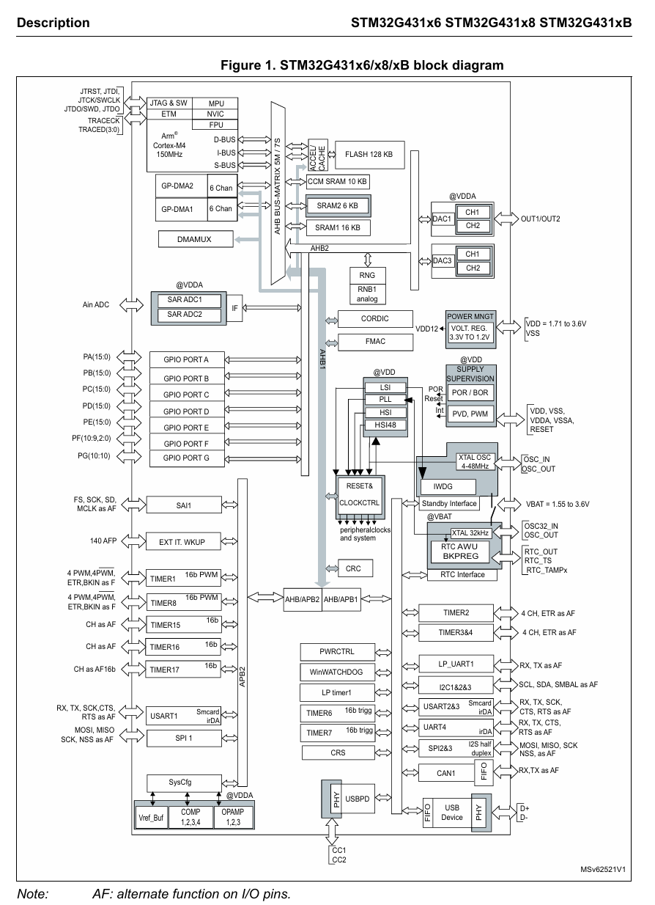
    <figcaption>block diagram：单片机内部各种功能模块简图</figcaption>
</figure>

一个关键概念是**引脚复用（PIN Mux）**：同一根引脚，可以通过配置连接到内部不同的功能模块，从而实现不同功能。比如一个引脚既可以当普通 GPIO 用，也可以复用成定时器的 PWM 输出通道——这正是一会儿要讲的 TIM 和 PWM 的基础。

## 二、GPIO：可编程的数字电平开关

GPIO（General Purpose Input/Output，通用输入输出端口）本质上是**可编程的数字电平开关**：

- **输出模式**：对外输出高/低电压（比如点亮 LED）
- **输入模式**：感知外界电压（比如读按键、读传感器）

<figure>
    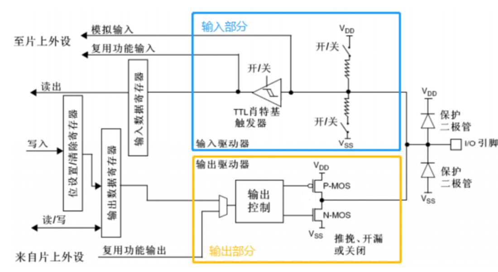
    <figcaption>GPIO 输入/输出模式：内部结构示意（施密特触发器用于数字量整形）</figcaption>
</figure>

输入模式细分有：浮空输入、上拉输入（弱上拉）、下拉输入（弱下拉）、模拟输入；输出模式细分有：开漏输出、开漏复用输出、推挽输出、推挽复用输出。信号经过施密特触发器整形成干净的 0/1 数字量。

> 课后提问：推挽输出和开漏输出，在使用场合上有什么不同？

**怎么用**：在 CubeMX 里指定引脚（Port、Pin）和模式，生成代码后调用 HAL 库函数即可。输入模式常见函数是读取引脚电平，输出模式常见函数是设置引脚输出高/低电平。

## 三、TIM：定时器

定时器（Timer）的作用是**定时触发中断**：时钟脉冲驱动计数器，计数器达到设定计数值时产生"更新事件"，从而触发中断，在中断里执行我们的代码。

用一个闹钟例子理解：每周六晚八点开组会，工作太多怕错过，就定个闹钟——每 7 天一个周期触发，响铃（中断）后我去开会。**好处**是不用一直盯着时间，响铃之前可以干别的事，节省 CPU 开销，是非阻塞式的。

### 时钟源

定时器的"时钟脉冲"来自时钟源，常见有：

- **HSE**：外部高速时钟（外部晶振，如 8MHz）
- **HSI**：内部高速时钟
- **LSE / LSI**：外部/内部低速时钟

<figure>
    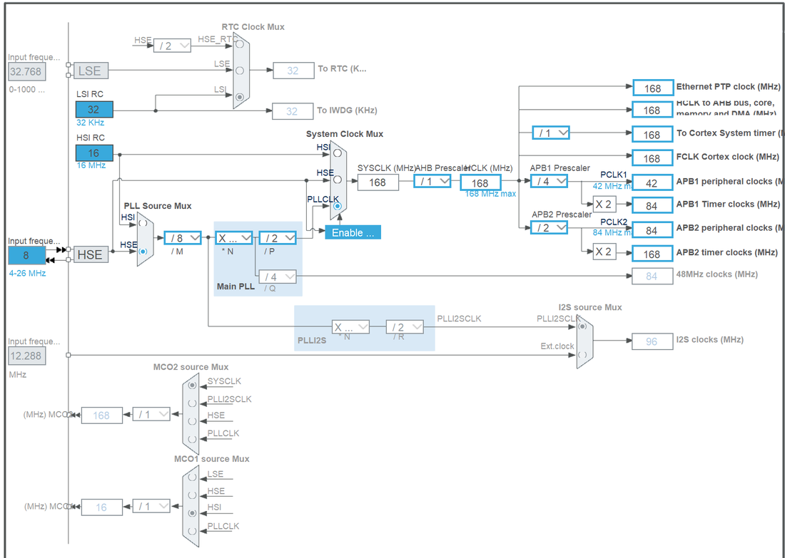
    <figcaption>CubeMX 时钟树配置界面（STM32F407 示例，主频最高 168MHz）</figcaption>
</figure>

<figure>
    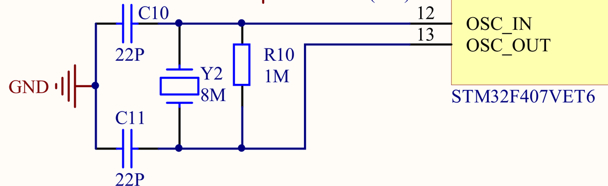
    <figcaption>外部晶振（HSE）在原理图中的接法</figcaption>
</figure>

### 挂在不同的 APB 总线上

不同定时器挂载在不同 APB（Advanced Peripheral Bus，高级外设总线）上，**不同总线的时钟频率可能不同**，具体要查数据手册。例如 STM32F407：TIM1、TIM8 挂在 APB2 上；TIM2\~TIM5、TIM6、TIM7 挂在 APB1 上。

<figure>
    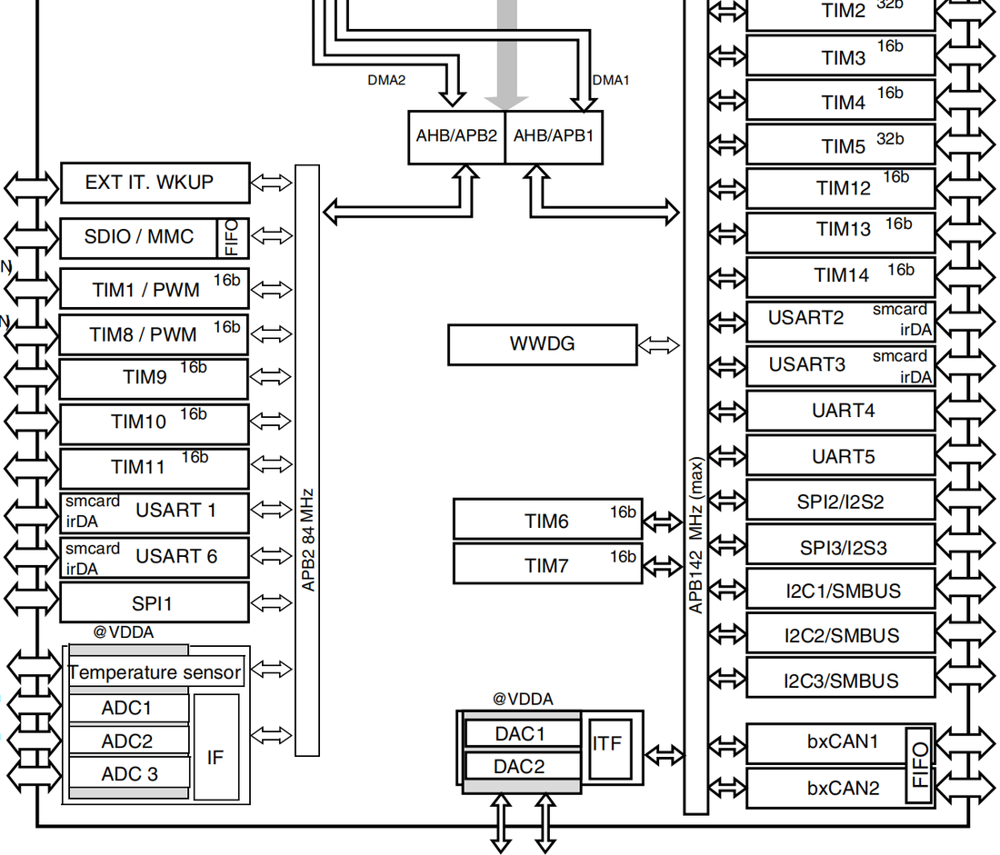
    <figcaption>数据手册 block diagram：不同定时器挂在不同 APB 总线，时钟频率不同</figcaption>
</figure>

### PSC、ARR 与计数模式

确认时钟频率后，定时器设定的关键数值有两个：

- **PSC**（Prescaler，预分频器）：对输入的时钟再次分频（降频）
- **ARR**（AutoReload Register，自动重装载寄存器）：计数器的上限值，溢出时产生**更新事件**（一个硬件信号，可以放任或处理）

计数模式有三种：**向上计数**、**向下计数**、**中央对齐计数**。

<figure>
    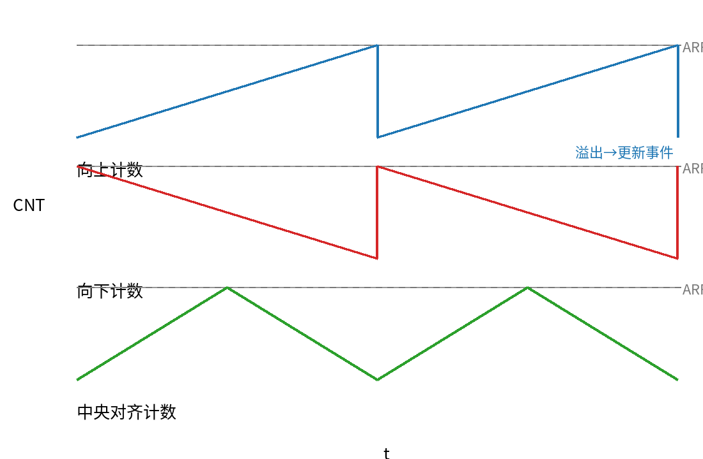
    <figcaption>三种计数模式：向上 / 向下 / 中央对齐（溢出产生更新事件）</figcaption>
</figure>

算一个例子（TIM1，向上计数，168MHz 时钟）：

```text
PSC = 167  ->  分频后时钟频率 = 168 / (PSC+1) = 1 MHz
ARR = 999  ->  计数器溢出速率 = 1 / (ARR+1) = 1 kHz
```

溢出产生的更新事件作为中断触发源，就是"定时中断"。

### 中断与中断回调

中断（ISR，Interrupt Service Routine）：事件触发时 CPU 暂停当前任务，跳转到中断函数执行其中代码逻辑。而 HAL 库在执行完中断函数后，还会继续执行对应的**中断回调函数**（Callback Function）。

> 课后提问：为什么要区分中断函数和中断回调函数？两者代码是否各有侧重？

### 定时器分类

不同定时器能力范围不同：

1. **基本定时器**（如 F4 的 TIM6、TIM7）：只能向上计数，不与外部 I/O 引脚连接
2. **通用定时器**（如 TIM2\~TIM5）：支持三种计数模式，至多同时产生 4 路 PWM 输出
3. **高级定时器**（如 TIM1、TIM8）：覆盖通用定时器功能外，还支持**互补 PWM 输出 + 可编程死区**、**刹车功能**等

<figure>
    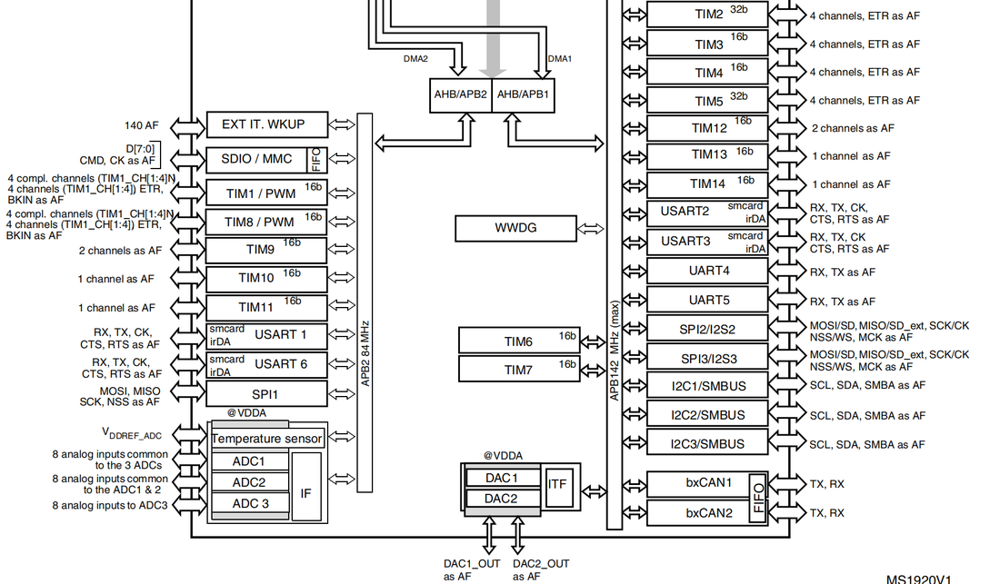
    <figcaption>定时器分类（数据手册框图）：基本 / 通用 / 高级</figcaption>
</figure>

> 课后提问：互补 PWM 和可编程死区可能应用在哪里，为什么？（提示：想想 H 桥电机驱动）

## 四、PWM：脉冲宽度调制

PWM（Pulse Width Modulation，脉冲宽度调制）字面拆开看：

- **脉冲**：高低电平交替的方波信号
- **宽度**：高电平持续的时间

核心参数两个：**频率**（方波交替快慢）和**占空比**（高电平时间占整个周期的百分比）：

```text
占空比 d = 脉冲宽度 / 周期 T
```

<figure>
    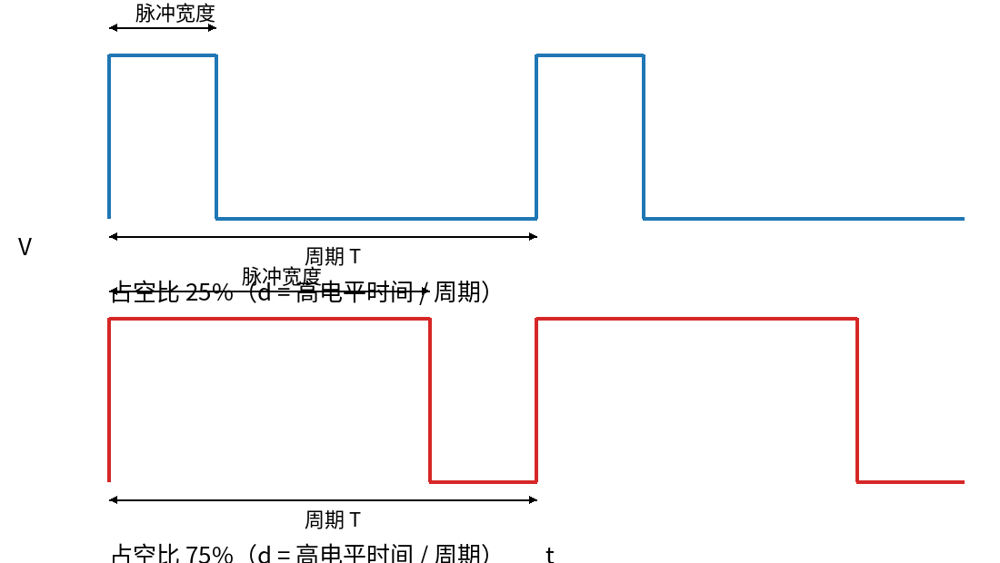
    <figcaption>占空比 = 高电平时间 / 周期（25% 与 75% 对比）</figcaption>
</figure>

**为什么需要 PWM**：单片机 GPIO 只能输出高（3.3V）或低（0V），但被控对象往往需要一个中间值（比如 1.65V、2.7V）。用数字量输出、对时间平均，就可以得到**类似模拟量的输出效果**——典型应用就是直流电机控速、呼吸灯调亮度。PWM 是固定周期的，所以用定时器实现最自然。

### CCR：比较/捕获寄存器

实现 PWM 的关键是第三个寄存器 **CCR**（Capture/Compare Register，比较/捕获寄存器）：把 CCR 与 CNT（计数器当前值）比较，**CCR 高于 CNT 输出高电平，反之输出低电平**。

```text
占空比 d = CCR / (ARR+1) * 100%
```

改变 CCR 的值，就能输出可变占空比。

<figure>
    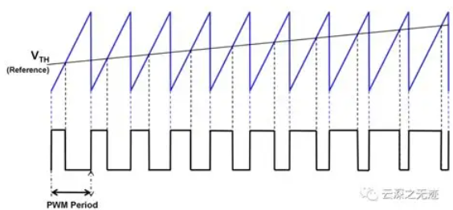
    <figcaption>CCR 与 CNT 比较：改变 CCR 即可改变输出占空比</figcaption>
</figure>

> 课后提问：（1）大功率电机仍需要 PWM 控制，仅仅用单片机输出 PWM 能直接驱动电机转动吗？（2）单片机输出数字信号电平为 0V 和 3.3V，想用 PWM 驱动 12V 的直流电机怎么办？

## 五、实践：从原理图到 Keil 点灯

下篇以"板载 LED 点灯 + 周期灯"为例，走完从硬件确认到代码验证的完整链路。

### 5.1 先看原理图与硬件连线

**从原理图读出板载 LED 的驱动关系**：本板 LED 为 D2 → R13 → PA6，D2 另一端接 3V3。也就是说 **PA6 输出低电平时形成电流通路，LED 点亮**（低电平点亮）。

<figure>
    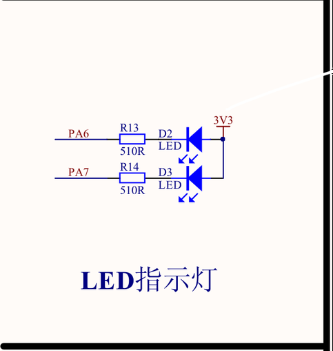
    <figcaption>原理图：D2 — R13 — PA6，PA6 低电平点亮 LED</figcaption>
</figure>

> 为什么先看原理图？**芯片型号相同 ≠ 板级电路相同**，板载资源由开发板决定。配置 CubeMX 之前必须先查本板原理图。

**SWD 接线**（按丝印）：J-Link 端 → 开发板 SWD 端，一一对应：3V3(VCC)→3V3、SWDIO→SWDIO、SWCLK→SWCLK、GND→GND。

<figure>
    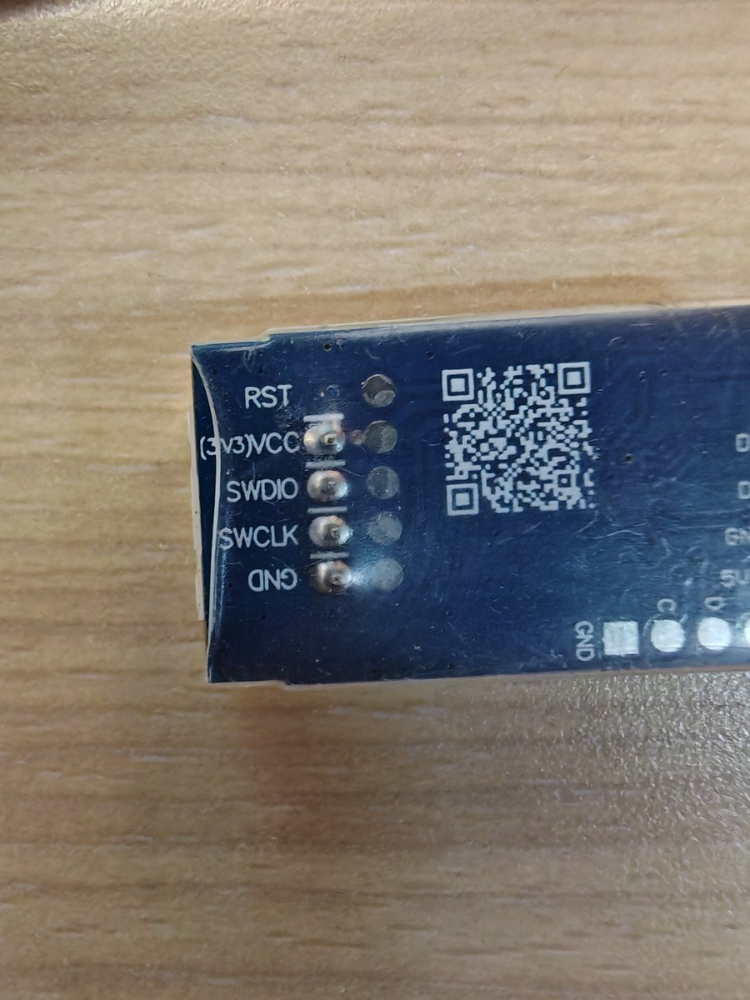
    <figcaption>J-Link 与开发板 SWD 端按丝印接线（VCC / SWDIO / SWCLK / GND）</figcaption>
</figure>

### 5.2 CubeMX 配置

**① 新建工程**：Home → ACCESS TO MCU SELECTOR，搜索并选中完整型号 STM32F407VET6，核对 LQFP100 / Flash 512KB 后 Start Project。

**② 系统基础配置**（System Core）：

- **SYS**：Debug 选 **Serial Wire**（SWD 调试接口，PA13=SWDIO、PA14=SWCLK）
- **时基**：Timebase Source 改为 **TIM7**（为 HAL_GetTick / HAL_Delay 提供 1ms 节拍；把 SysTick 留给后面要用的 FreeRTOS）
- **RCC**：HSE 选 Crystal/Ceramic Resonator（外部晶振比内部 RC 稳定）；LSE Disable（不用 RTC 就不占用 PC14/PC15）

**③ 时钟树**：按图配置得到 168MHz 主频；注意 TIM6 位于 APB1，**APB1 预分频不为 1 时定时器时钟 = 2 × PCLK1 = 84MHz**。

<figure>
    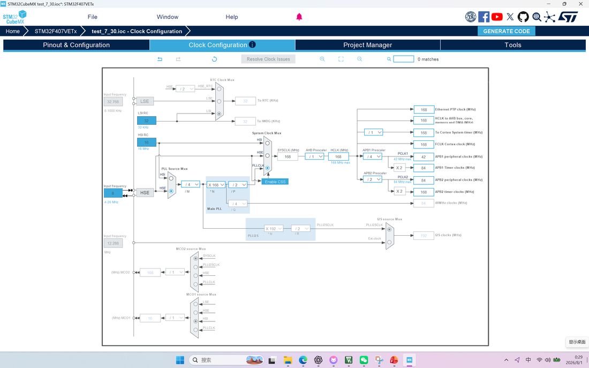
    <figcaption>时钟树配置：主频 168MHz，TIM6 挂 APB1 = 84MHz</figcaption>
</figure>

**④ GPIO 配置**：芯片图上点击 PA6 → GPIO_Output（变绿表示功能已分配）；System Core → GPIO → PA6，把 GPIO output level 设为 **High**（上电先熄灯，因为本板低电平点亮）；输出模式 Output Push Pull / No pull；Maximum output speed 选 Low 即可（普通 LED 用，速度不是越高越好，高速会增加干扰和功耗）。

**⑤ Project Manager**：Project Name/Location 用英文；Toolchain/IDE = **MDK-ARM**（Keil5）；勾选 **Keep User Code**（重新生成时保留 USER CODE 内容）；勾选"每个外设生成独立 .c/.h"。

**⑥ 生成代码**：确认 Pinout 与 Clock 页面没有红色冲突 → GENERATE CODE → 打开 MDK-ARM 文件夹里的 .uvprojx。之后**每次修改配置都要再次 Generate Code**，自己的代码只写在 USER CODE BEGIN / END 之间。

### 5.3 Keil 与工程规范

**首次配置**：Options for Target → Debug → Use: J-LINK / J-TRACE Cortex → Settings → Port = SW。先把下载链路配通，再开始写代码。

**编译、连接、下载、调试**：每一步只解决一个问题——Build 先做到 0 Error；J-Link 能识别目标芯片；Download 出现 Programming Done；最后 Debug 运行与观察。看到哪一步失败，就只检查那一层，不要同时改接线、配置和代码。

**调试技巧**：断点（点击左侧边栏，命中后程序停在当前行）；Watch（View → Watch Windows → Watch 1，右键变量 Add to Watch 1 观察值和类型）；Go To Definition（光标放符号上按 F12 跳到定义）。

<figure>
    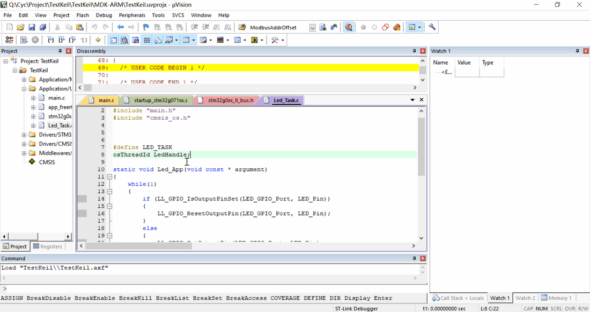
    <figcaption>Keil5 Debug 模式：断点 + Watch 观察变量</figcaption>
</figure>

**代码规范**：.c 文件放函数实现、变量的唯一定义和本文件私有 static 数据；.h 文件只公开声明（类型/宏、结构体枚举、extern 变量声明、函数声明），供 #include 使用。

### 5.4 TIM6 配成 1ms：非阻塞延时

**先读时钟，再算参数**：

```text
更新周期 = (PSC + 1) × (ARR + 1) ÷ TIM6_CLK
```

通用步骤：在时钟树读取 TIM6_CLK → 先把计数频率分到 1MHz（PSC）→ 再让 ARR 产生 1000 个计数。示例（TIM6_CLK = 84MHz）：

```text
PSC = 83    计数频率 = 84MHz / (83+1) = 1 MHz
ARR = 999   更新频率 = 1MHz / (999+1) = 1 kHz = 1ms
```

**CubeMX 配置 TIM6**：Clock Source 选 Internal Clock，Prescaler 和 Counter Period 按本工程 TIM6_CLK 重新计算（图中数值不可直接照抄），NVIC Settings 里开启 TIM6 中断。生成代码后还要在 Keil 里调用 `HAL_TIM_Base_Start_IT(&htim6);` 才能真正启动。

<figure>
    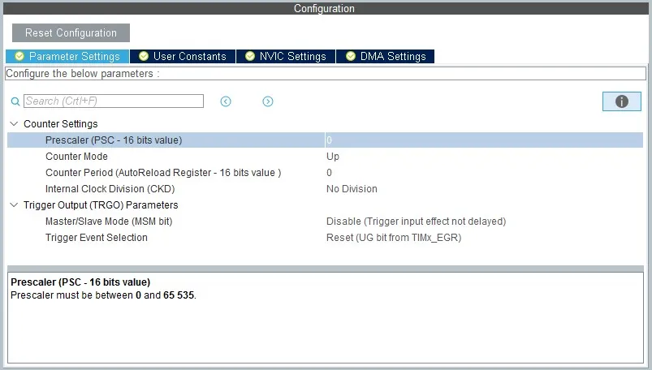
    <figcaption>TIM6 参数与 NVIC 配置（数值需按本工程 TIM6_CLK 重新计算）</figcaption>
</figure>

**初始化 ≠ 启动**：`MX_TIM6_Init()` 只完成初始化，不会自动启动计数和中断。中断链路是：更新事件 → `TIM6_DAC_IRQHandler` → `HAL_TIM_IRQHandler` → `PeriodElapsedCallback`。

**HAL_Delay 为什么是阻塞的**：看它的实现——在一个 while 循环里一直检查 `HAL_GetTick()` 是否达到目标时间，期间当前函数无法返回，主循环无法处理后续任务（按键、通信、传感器都会延后）。注意"阻塞"不等于"CPU 完全停止"，中断仍然可能执行。所以延时要么拆到中断回调里，要么用状态机管理，避免在 while 里傻等。

### 5.5 状态机与 J-Scope 验证

一个状态机由五部分组成：

1. **状态**：现在处于哪个阶段
2. **事件**：什么条件触发检查
3. **转移**：从哪个状态切到哪个状态
4. **动作**：进入或离开状态时做什么
5. **时间**：在状态中停留多久

用状态机把"周期灯"这类时序逻辑拆成可验证的小步，配合 J-Scope 观察变量波形，就能验证非阻塞延时的实际效果。

## 六、小结

- 单片机是代码的物理载体，**引脚复用**让同一引脚按配置连接不同功能模块
- **GPIO** 是可编程数字电平开关：输入看外界电压，输出给高低电平；模式有浮空/上拉/下拉/模拟输入，开漏/推挽输出
- **TIM** 定时触发中断：PSC 降频、ARR 定上限、溢出产生更新事件；三种计数模式；不同定时器挂不同 APB 总线，时钟频率要查手册；中断函数与回调函数分工不同
- **PWM** 用定时器产生固定周期方波，占空比 d = CCR/(ARR+1)×100%，改 CCR 就能调速/调亮度
- 实践链路：**原理图 → CubeMX → Keil → 下载调试**，每步只解决一个问题；自己的代码只写在 USER CODE 区
- 定时器做非阻塞延时：先读 TIMx_CLK 再算 PSC/ARR，`HAL_TIM_Base_Start_IT` 才真正启动；阻塞延时会让主循环卡死
- 复杂时序用**状态机**拆分，配合 J-Scope 验证