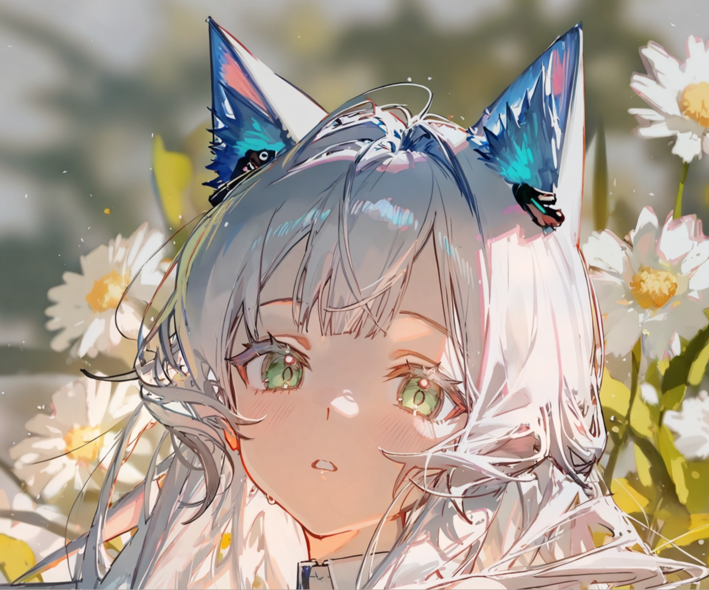
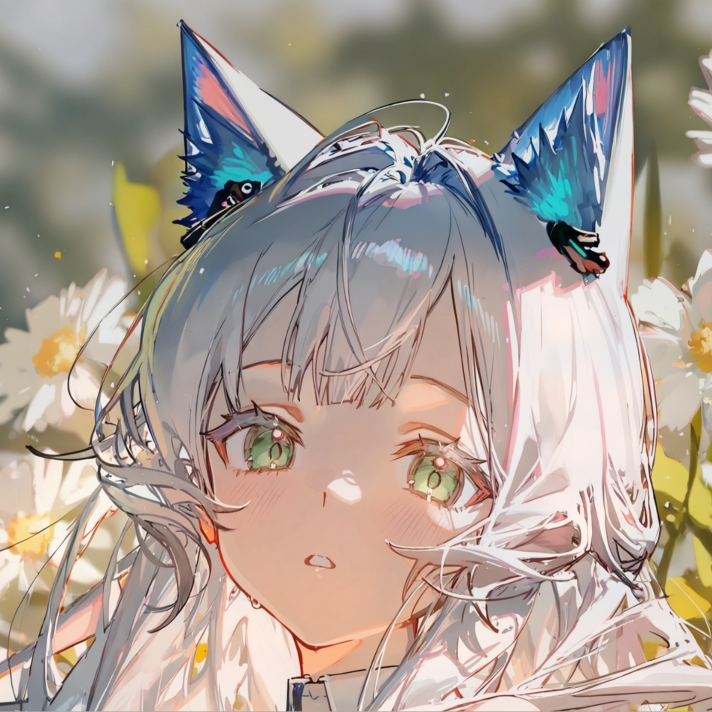

最近想把一张动漫风格的图片裁成以人物面部为中心的 1:1 头像，要求保留原图、另存裁剪结果。任务本身很简单，但追问下去却牵出一整套"机器如何理解图片里的人在哪儿"的算法体系，记录一下。

## 需求与最直接的方案

原图 `香香.png` 的尺寸是 1720 × 1433，横向比纵向宽。要得到 1:1，边长为较短边 1433，需要横向去掉 287 像素：

<figure>
    
    <figcaption>原图：1720 × 1433</figcaption>
</figure>

ImageMagick 一行命令即可，关键在裁剪起点：

```bash
# 计算横向偏移：(1720 - 1433) / 2 = 143.5，取整为 143
magick 香香.png -crop 1433x1433+143+0 +repage 香香-1x1.png
```

`-crop WxH+X+Y` 表示从左上角 `(X, Y)` 开始取 `W × H` 的区域，`+repage` 丢弃裁剪后残留的虚拟画布信息。得到的结果：

<figure>
    
    <figcaption>裁剪结果：1433 × 1433（原图保持不变，另存新文件）</figcaption>
</figure>

## 居中裁剪其实是个特例

这里之所以敢直接居中裁剪，是因为人物本来就接近画面中心，双眼、脸、猫耳和下巴都在安全区内。

但"以人物面部为中心"在通用场景下是个含糊的需求：人物可能偏左、偏右、仰头、倾斜，甚至画面里有多个人。这时候居中裁剪就会把人物截断，必须真正"找到脸"，再决定裁剪框。

## AI 视觉模型是怎么"看懂"人物的

先说我在和 AI 对话时得到的直觉解释：现代视觉模型并不会先输出坐标再识别，而是把图像切成许多小块，每个小块编码成特征向量，描述局部的颜色、边缘、纹理和形状；再通过注意力机制建立区域之间的关系。

以这张图为例，模型会综合以下线索：

- 左右各有一个外形、纹理相似的绿色椭圆区域（眼睛），且大致水平排列
- 两眼间距符合面部比例，中间存在鼻部特征
- 下方有嘴巴和下巴轮廓
- 外围有头发、肤色连续区域与脸部轮廓
- 两只眼睛的视角和绘画风格一致

于是在模型内部形成类似"左眼 ─ 同一张脸 ─ 右眼"的语义关系。这个过程在特征空间里同时完成区域定位和语义判断，而不是"先检测、后推理"的两步流程。缺点是这些内部特征对应的精确坐标无法直接读取——这也是为什么需要可复现的经典算法。

## 可复现的算法路线：人脸检测 + 关键点

如果要写程序自动完成"找到面部中心并裁剪"，标准流程如下。

### 1\. 人脸检测

检测器先输出一个或多个人脸框，每个框带置信度：

```text
B_i = (x_i, y_i, w_i, h_i, c_i)
```

单人图片通常选择面积与置信度综合最高的框：

```text
i* = argmax_i ( c_i * sqrt(w_i * h_i) )
```

### 2\. 预测面部关键点

关键点模型对选中的脸输出各部位坐标：左右眼角、左右眼中心、鼻尖、左右嘴角、下巴、脸部轮廓等。

模型通常为每个关键点生成一张概率热力图：

```text
H_k(x, y) = P(关键点 k 位于 (x, y))
```

坐标可由最大值取得（argmax），也可用 soft-argmax 得到更平滑的亚像素坐标：

```text
p_k = Σ (x, y) * softmax(H_k(x, y))
```

### 3\. 计算双眼中心与眼距

每只眼睛取多个关键点的平均作为眼中心：

```text
E_L = (1/n) Σ p_k      E_R = (1/m) Σ p_k
```

双眼中点与眼距：

```text
M = (E_L + E_R) / 2
d = |E_R - E_L|
```

如果头部倾斜，可用眼睛连线角度校正：

```text
θ = atan2(E_R.y - E_L.y, E_R.x - E_L.x)
```

以 M 为旋转中心旋转 -θ 即可摆正头部。

### 4\. 确认两只眼睛属于同一张脸

若眼睛是独立检测的，需要配对。合理的眼睛对通常满足（w_f、h_f 为脸框宽高）：

```text
|y_L - y_R| < 0.15 * h_f
0.2 * w_f < |x_L - x_R| < 0.7 * w_f
```

并要求：两眼都在同一脸框内、位于脸框上半部分、尺寸相近、置信度足够高、双眼中点接近脸框水平中心、鼻子位于中点下方、嘴巴位于鼻子下方。可以构造加权匹配分数：

```text
S = λ1*S_水平 + λ2*S_眼距 + λ3*S_尺寸 + λ4*S_对称 + λ5*S_脸框包含
```

取分数最高的眼睛对；多人图中可用匈牙利算法把候选眼睛分配给不同人脸。实践中，关键点模型通常一次性预测一张脸的所有关键点，因此一般不需要单独配对。

### 5\. 计算 1:1 裁剪框

根据眼距估计头像尺度：

```text
s = k * d
```

k 按构图需求调整：只保留脸部取较小值，要保留头发、兽耳和肩部则需要更大值。

裁剪中心不能直接用双眼中点——眼睛位于脸部上半部分，普通头像应把中心向下移：

```text
C = (M.x, M.y + α * s)
```

但本图的猫耳很高，直接下移会截掉耳朵，应结合头部或人物分割框把中心向上修正。更稳妥的做法是求各区域的并集：脸部框、头发框、左右猫耳框、肩部框，得到人物主体框 B_s，以其中心作为候选裁剪中心，同时保证眼睛和下巴落在安全区内。

最终正方形：

```text
R = (C.x - s/2, C.y - s/2, s, s)
```

最后把坐标限制在图片边界内；若裁剪框越界，应平移裁剪框而不是缩小人物。

## 动漫图片的特殊问题

普通人脸关键点模型主要针对真人照片，在动漫图上会遇到：

- 眼睛比例远大于真人，眼距约束失效
- 鼻子特征非常弱，无法作为垂直锚点
- 发丝遮挡脸部轮廓，脸框定位偏差
- 猫耳可能被误认为头部边缘
- 左右眼的绘画透视不完全对称

更可靠的方案是使用动漫人脸数据训练的检测器和关键点模型，或者直接训练人物分割模型，再结合眼睛关键点确定裁剪中心。对这张图来说，"人物分割框 + 面部关键点"的组合会比单纯的人脸检测更合适——只做人脸裁剪很可能截掉猫耳。

## 小结

- 简单场景：原图 1720 × 1433，居中裁剪一行命令 `magick -crop 1433x1433+143+0 +repage` 即可，原图保持不变
- 通用场景："以人物为中心"背后是一整套 人脸检测 → 关键点预测 → 双眼几何 → 裁剪框约束 的流程
- 关键点模型输出热力图，argmax 或 soft-argmax 取坐标；双眼中心、眼距、倾角都能从关键点直接算出
- 裁剪中心需要根据构图（这里的高猫耳）在"眼睛中点"基础上修正，越界时平移而非缩小
- 动漫图要选对人脸模型，或改用"人物分割 + 关键点"组合